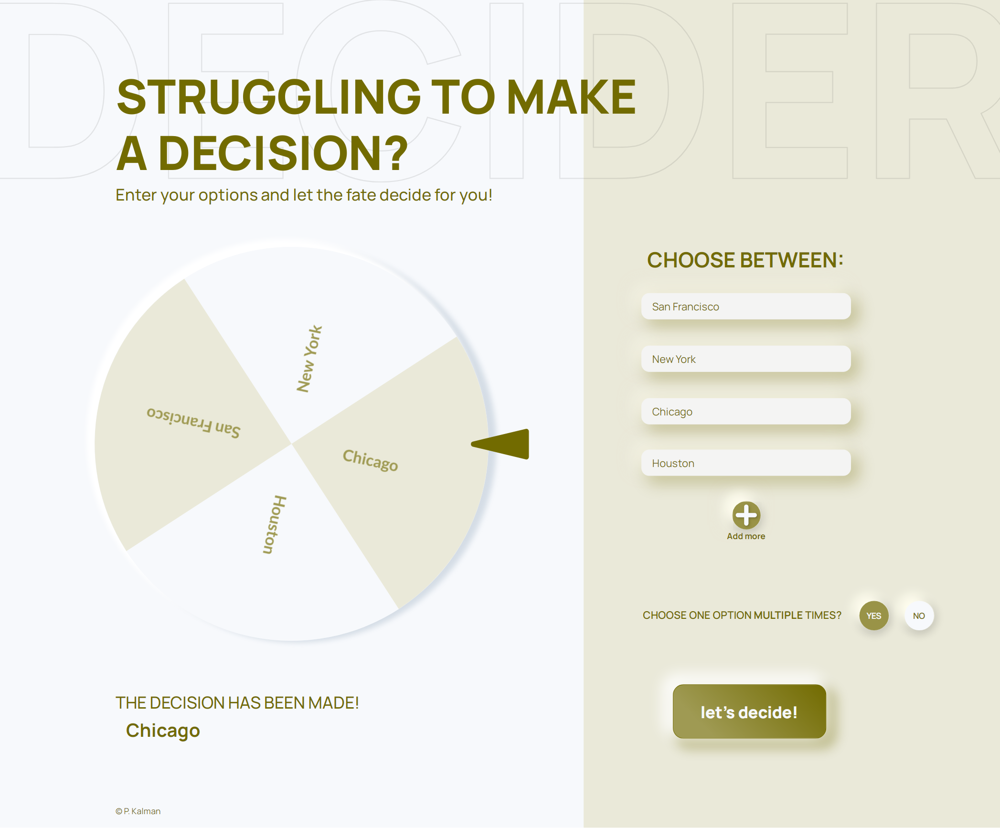

# PIOTR KALMAN - Decider

## General Info

> Hello, Decider is a decision making online roulette
> based on Vanilla JS and HTML Canvas.

## Table of contents

- [General info](#general-info)
- [Technologies](#technologies)
- [Sections](#sections)
- [Instruction to tun](#instruction-to-run)
- [Instruction to use](#instruction-to-use)
- [Where to watch](#where-to-watch)
- [Mockup](#mockup)
- [Contact](#contact)

## Technologies

    HTML5
    CSS3
    sass
    font-awesome

## Sections

##### Header

- Very simple decription and instruction

##### Wheel and options form

- form form enter options which we want to draw one of them

## Instruction to run

All you need to do for run this up is open index.html file in your browser :)

## Instruction to use

If you have some choices, and you want to make a decicion, please enter options to form. After each option entered, the wheel should automatically reload.

After entered all options, all you have to do is click Let's Decide button or press Enter/Return key

You have two modes to choose from, with or without remove drawn option from the wheel

Have fun :)

## Where to watch

To see this project in use, please visit: https://morswin19.github.io/decider/

## Mockup

## Contact

Feel free to contact me: piotr.kalman85@gmail.com
